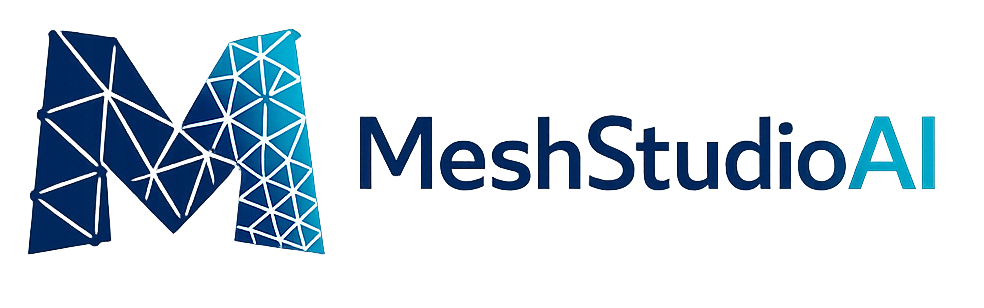

<p align="center">
  
</p>

MeshStudioAI presents a collection of AI tools for adaptive meshing in the context of finite element methods (FEM). The repository builds on the G-Adaptivity approach taken in [G-Adaptivity: a GNN-based approach to adaptive mesh relocation for finite element methods (FEM)](https://openreview.net/forum?id=pyIXyl4qFx).

Full documentation: https://georgaut.github.io/MeshStudioAI/

## Quickstart

1. Install and activate a Firedrake environment.
2. Install this repo.
3. Run a demo notebook from `examples/` (recommended starting point: `examples/navier_stokes_adaptivity_demo.ipynb`).

For detailed guides (including datasets, training, evaluation, and troubleshooting), see the full documentation: https://georgaut.github.io/MeshStudioAI/

## Installation


Please note MeshStudioAI currently requires Python 3.10-3.13 and [Firedrake](https://www.firedrakeproject.org/), a Python-based finite element library used to solve the PDEs.

We recommend installing Firedrake via the official [Firedrake installation guide](https://www.firedrakeproject.org/install.html#installing-firedrake), which also sets up a dedicated virtual environment. Please be mindful to use Python 3.10-3.13 when installing Firedrake.

Once Firedrake is installed and its virtual environment is activated, install this repo and its Python dependencies:

```bash
git clone https://github.com/GeorgAUT/MeshStudioAI
cd MeshStudioAI
pip install -e .
```

## Documentation

Full documentation is available at https://georgaut.github.io/MeshStudioAI/.

Key pages:

- Installation: https://georgaut.github.io/MeshStudioAI/getting-started/installation/
- Navier–Stokes demo notebook: https://georgaut.github.io/MeshStudioAI/getting-started/navier-stokes-adaptivity/
- Advanced topics (datasets, full training + evaluation): https://georgaut.github.io/MeshStudioAI/guides/

## Repository layout

- `src/run_GNN.py`: training loop (PyTorch + PyTorch Geometric)
- `src/run_pipeline.py`: evaluation + plotting + W&B integration
- `src/pde_solvers.py`: Firedrake PDE solvers used to generate data / compute losses
- `src/data.py`, `src/data_mixed.py`: dataset definitions
- `src/models/`: GNN mesh adaptor model(s) and baselines
- `configs/`: experiment configurations

## Known issues

- Anaconda is known to cause issues when installing Firedrake on macOS. Homebrew is recommended where possible. See the Firedrake installation guide, Firedrake issue tracker, and the troubleshooting section of the docs: https://georgaut.github.io/MeshStudioAI/troubleshooting/

## License and citation

This open-source version of our code is licensed under Apache 2.0. If you use this work, please cite:

```text
@inproceedings{Rowbottom_G-Adaptivity_optimised_graph-based_2025,
    author = {Rowbottom, James and Maierhofer, Georg and Deveney, Teo and Müller, Eike Hermann and Paganini, Alberto and Schratz, Katharina and Lio, Pietro and Schönlieb, Carola-Bibiane and Budd, Chris},
    booktitle = {Proceedings of the Forty-second International Conference on Machine Learning},
    title = {{G-Adaptivity: optimised graph-based mesh relocation for finite element methods}},
    year = {2025}
}
```
